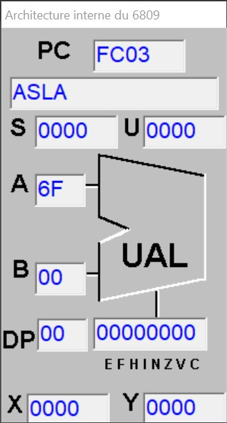

***
<pre>INSEA                  <i>Assembleur</i></pre>
***
<h1 style="text-align:center">Correction de TD1</h1>

***
<pre>Lundi 23/12/2024       Auteur : Mrimi Imad</pre>

<style>img{width:160px;height:280px}</style>

## Exercice 1 :
Transférez le contenu de l'adresse mémoire 0040 à l'adresse 0041.
- **Solution Proposée** 
```
LDA #$6A
STA $0040
TFR A,B
STB $0041
END
``` 
- **Simulation pas à pas**


## Exercice 2 :
Faites la somme des contenus des adresses mémoire 0003 et 0004 et placez le résultat à l’adresse mémoire
0005.

- **Solution Proposée** 
```
LDA $0003
ADDA $0004
STA $0005
END
``` 
- **Simulation pas à pas**


## Exercice 3 :
Décalez le contenu de l'adresse mémoire 0003 par un bit à gauche et placez le résultat à l’adresse 0004. Effacez
le contenu du bit de la position 0.
- **Solution Proposée** 
```
;1er Méthode;
LDA $0003
ASLA
STA $0004
END
``` 
> `ASLA` exprime le décalage à droite.
```
;2éme Méthode;
LDA $0003
ADDA $0003
STA $0004
END 
```
- **Simulation 
pas à pas** 
    - First Method





   - Second Method


## Exercice 4 :
Chargez le registre A par le contenu de la mémoire 0040.  
Effacez le contenu de la mémoire 0040.  
Charger le contenu du registre A dans la mémoire 0041.  
Effacez le contenu du registre A.  
- **Solution Proposée** 
```
LDA $0040
CLR $0040
STA $0041
CLRA
END
``` 
- **Simulation pas à pas**


## Exercice 5 :
Ajoutez Le nombre de 16bits stocké dans les adresses de la mémoire **$0000** et **$0001** au nombre de 16 bits se
trouvant aux adresses mémoire **$0002** et **$0003**. Le bit le plus significatif sont dans les cases **$0000** et **$0002**.
Stockez le résultat dans la case mémoire **$0004** et **$0005** sachant que le bit le plus significatif doit être stocké
dans la case **$0004**.
- **Solution Proposée** 
```
LDD $0000
ADDD $0003
STD $0004
END
``` 

- **Simulation pas à pas**


